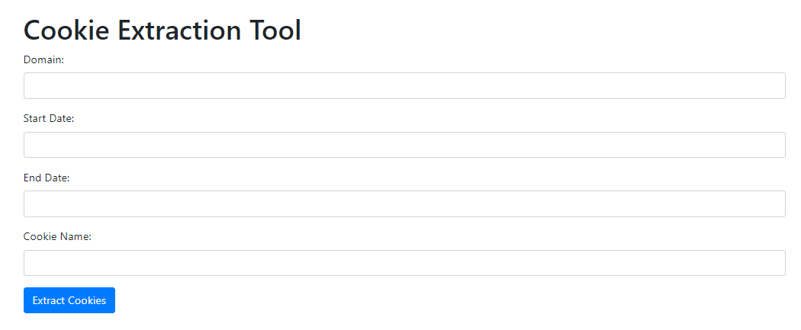

# Chrome Cookie Extraction Tool

This simple Python script is used to extract cookies from the Google Chrome browser. It can extract cookies from a specific domain or date range, and allows you to edit or delete cookies.

## Usage

1. Make sure you have Python 3.x installed.
2. Run the `extract_cookies.py` script to extract cookies.
    - You can use the `domain` parameter to extract cookies from a specific domain.
    - You can use the `start_date` and `end_date` parameters to extract cookies from a specific date range.
    - You can use the `cookie_name` parameter to extract cookies with a specific cookie name.
    - Example usage: `python extract_cookies.py --domain example.com --start_date 1646713200000 --end_date 1646716800000 --cookie_name session`

## Editing and Deleting Cookies

You can use the following functions to edit or delete a specific cookie:

```python
edit_cookie(cookie_name, new_value)
delete_cookie(cookie_name)

## Development
1. Clone the project: git clone https://github.com/your_username/chrome-cookie-extractor.git
2. Navigate to the project directory: cd chrome-cookie-extractor
3. Install the required dependencies: pip install -r requirements.txt
4. Develop and test your code.
5. Commit your changes and push.